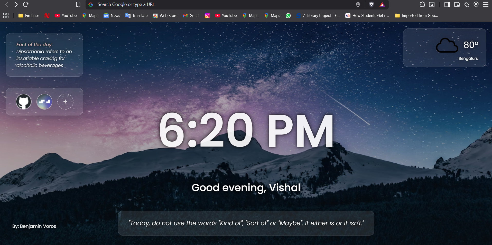

# Personal Dashboard

A beautiful, personalized browser dashboard that replaces your new tab page with useful information and quick access to your favorite sites.



## ✨ Features

- **Dynamic Backgrounds**: Beautiful landscape images from Unsplash with smart text color adaptation
- **Customizable Categories**: Choose from Nature, Travel, Architecture, Technology, Food, Art, Animals, or Space themes
- **Live Weather**: Location-based weather display with custom weather icons
- **Time & Date**: Real-time clock with personalized greetings
- **Quick Links**: Customizable shortcuts to your favorite websites with favicon support
- **Daily Content**: 
  - Random advice/quotes for daily inspiration
  - Interesting facts to learn something new
- **Personalization**: Set your name for personalized greetings
- **Responsive Design**: Works beautifully on all screen sizes
- **Glass Morphism UI**: Modern, elegant interface with backdrop blur effects

## 🚀 Installation as Browser Extension

### Chrome/Edge/Brave

1. **Download the Extension**
   - Download or clone this repository to your computer
   - Extract the files if downloaded as ZIP

2. **Load in Browser**
   - Open Chrome/Edge/Brave and go to `chrome://extensions/` (or `edge://extensions/`)
   - Enable "Developer mode" (toggle in top-right corner)
   - Click "Load unpacked"
   - Select the dashboard folder containing the files

3. **Set as New Tab Page**
   - Go to browser settings
   - Find "On startup" or "New tab" settings
   - Set new tab page to open the extension
   - Or bookmark the extension page for quick access

### Firefox

1. **Temporary Installation** (for development)
   - Go to `about:debugging`
   - Click "This Firefox"
   - Click "Load Temporary Add-on"
   - Select any file in the dashboard folder

2. **For permanent installation**, you'll need to package as a proper Firefox extension

## 💻 Developer Setup

### Prerequisites
- Modern web browser with ES6 module support
- Basic knowledge of HTML, CSS, and JavaScript

### Project Structure
```
dashboard/
├── index.html          # Main dashboard page
├── index.css           # Styles and animations
├── index.js            # Main initialization script
├── manifest.json       # Browser extension manifest
├── assets/             # Weather icons and static assets
└── modules/            # Modular JavaScript components
    ├── background.js   # Unsplash background management
    ├── backgroundSettings.js # Background category selection
    ├── time.js         # Time, date, and greeting logic
    ├── weather.js      # Weather API integration
    ├── advice.js       # Daily advice/quotes
    ├── facts.js        # Random facts API
    ├── name.js         # User name management
    └── links.js        # Quick links management
```

### Code Architecture

#### Modular Design
The dashboard uses ES6 modules for clean separation of concerns:

- **`background.js`**: Handles Unsplash API calls, image analysis for text color adaptation
- **`time.js`**: Updates time/date display and manages personalized greetings
- **`weather.js`**: Integrates with OpenWeatherMap API for location-based weather
- **`advice.js`**: Fetches daily advice from AdviceSlip API
- **`facts.js`**: Gets random facts from API-Ninjas
- **`name.js`**: Manages user name input and storage
- **`links.js`**: Handles custom quick links with localStorage persistence
- **`backgroundSettings.js`**: Category selection modal for background images

#### Data Persistence
Uses `localStorage` for:
- User name
- Selected background category
- Custom quick links
- All preferences persist across browser sessions

#### APIs Used
- **Unsplash API**: Random landscape images with category filtering
- **OpenWeatherMap API**: Current weather by geolocation  
- **AdviceSlip API**: Daily motivational quotes
- **API-Ninjas Facts**: Random interesting facts

### Key Features Implementation

#### Smart Background Color Adaptation
```javascript
// Analyzes image brightness to choose appropriate text color
function analyzeImageAndSetTextColor(imageUrl, authorName) {
    // Canvas-based pixel analysis for optimal text contrast
}
```

#### Responsive Time Display
```javascript
// Real-time updates with personalized greetings
function updateTimeAndGreeting() {
    // Time formatting and greeting logic based on time of day
}
```

#### Customizable Quick Links
```javascript
// Dynamic favicon fetching and link management
function renderLinks() {
    // Generates clickable icons with edit/delete functionality
}
```

### Customization

#### Adding New Background Categories
Edit `modules/backgroundSettings.js`:
```javascript
const categories = ['Nature', 'Travel', 'YourNewCategory'];
```

#### Styling Modifications
Main styles in `index.css` use CSS custom properties for easy theming:
- Glass morphism effects with `backdrop-filter`
- Smooth animations with CSS transitions
- Responsive design with flexbox layouts

## 🔧 Development

### Local Development
1. Clone the repository
2. Open `index.html` in a modern browser
3. Or use a local server: `python -m http.server 8000`

### API Keys Setup

The dashboard requires API keys for some features. For security, these are stored in environment files:

1. **Copy the example environment file:**
   ```bash
   cp .env.example .env
   ```

2. **Get your API keys:**
   - [Unsplash API](https://unsplash.com/developers) - for background images
   - [OpenWeatherMap API](https://openweathermap.org/api) - for weather data
   - [API-Ninjas](https://api.api-ninjas.com/) - for daily facts

3. **Update `.env` file with your keys:**
   ```env
   UNSPLASH_API_KEY=your_actual_unsplash_key
   OPENWEATHER_API_KEY=your_actual_openweather_key
   API_NINJAS_KEY=your_actual_api_ninjas_key
   ```

4. **The keys are imported via `config.js`** - modify this file if you prefer different key management

### Browser Compatibility
- Chrome 61+
- Firefox 60+
- Safari 11+
- Edge 16+

## 🤝 Contributing

1. Fork the repository
2. Create a feature branch
3. Make your changes
4. Test across different browsers
5. Submit a pull request

## 📝 License

This project is open source and available under the MIT License.

---

Built with ❤️ using vanilla JavaScript, CSS Grid/Flexbox, and modern web APIs.